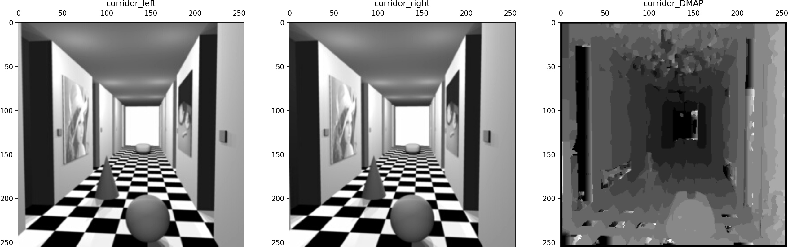
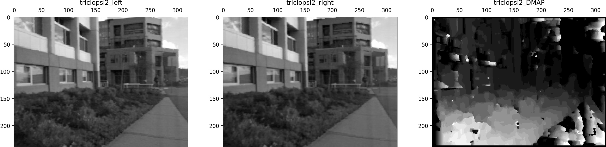
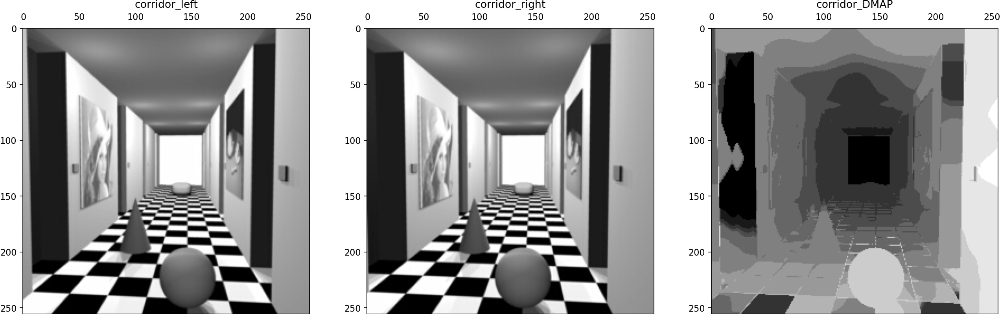
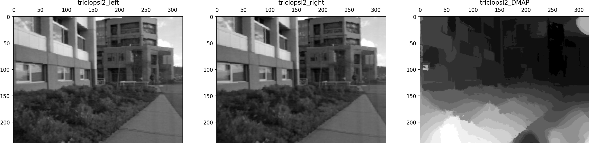

# AI6121: Assignment 2

## Problem Overview

Stereo vision uses stereoscopic ranging techniques to estimate a 3D model of a scene. It employs triangulation, a popular ranging technique, to compute the depth from 2D images. A key parameter in the triangulation is disparity, which is inversely proportional to the depth and can be computed from the correspondence points of two images of the same scene that are captured from two different viewpoints.

This assignment consists of the following tasks:

1. Describe the procedure of disparity computing given a pair of rectified images of the same scene captured from two different viewpoints.
2. Write a computer algorithm that computes the disparity of two images. The programming language can be Matlab, python, or other languages.
3. Apply your developed algorithm to the two provided image pairs and derive the corresponding disparity maps. Discuss your observation of the obtained disparity maps.
4. Discuss what affects the disparity map computation, and any possible improvements of your developed algorithm. Implement and verify your ideas over the provided test images. This subtask is optional, and there will be credit marks for nice addressing of this subtask.

## Approaches

1. Window-based Disparity Map Computation
2. Improvement Idea: Guided Filter Approach

## Tuned Results

### Window-based

### Guided Filter

## Source Code References

1. https://github.com/Z769018860/Simple-SSD-Stereo
2. https://github.com/2b-t/SciPy-stereo-sgm/blob/master/stereo_matching.py
3. https://github.com/leduoyang/Disparity_Estimation_Guided_Filter/blob/master/main.py

