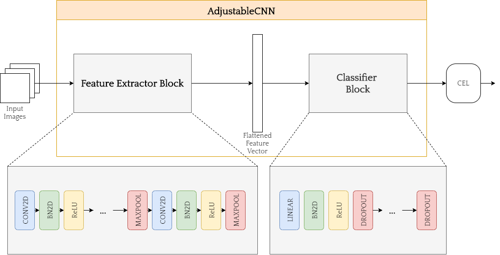
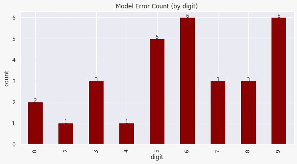

# AI6121: Course Project

## Team Members

1. Ong Jia Hui, Karyl
2. Tan Meng Xuan
3. Lim Zhi Xuan

## Problem Overview

The handwritten digit recognition is the ability of computers to recognize human handwritten digits. This project will work on the dataset MNIST, which is probably one of the most popular datasets among machine learning and deep learning enthusiasts. The MNIST dataset contains 60,000 training images of handwritten digits from zero to nine and 10,000 images for testing. It thus has 10 different classes, where each grayscale digit image is represented by a 28×28 matrix. You can download the dataset from the website: https://www.kaggle.com/sachinpatel21/az-handwritten-alphabets-in-csv-format or other websites.
You can adopt either multi-layer perceptron (MLP) or convolutional neural networks with different network backbone to develop your handwritten digit recognition system. You are free to use different programming languages, software libraries and functions, etc. in your implementation.
This project consists of the following tasks:

1. Design and develop your handwritten digit recognition network. Train your network over the MNIST training set, evaluate over the test set, and report your evaluation results. Your project report should include detailed description and discussion of your network design as well as your evaluation results. For the source codes, you can either append them at the end of the project report, or submit them separately.
2. Investigate different hyper-parameters and design options such as learning rate, optimizers, loss functions, etc. to study how they affect the network performance. The report should include detailed description and discussion of your study.
3. Benchmark with the state-of-the-art, and discuss the constraint of your designed network and possible improvements. Implement and verify your ideas over the test set. This subtask is optional, and there will be bonus marks for nice addressing of this subtask.

## Report Chapters

1. Introduction
2. Exploratory Data Analysis (EDA)
3. Model Design: Adjustable CNN (AJCNN)
4. Optimizers, Schedulers, Loss Function
5. Cross Validation for Hyperparameter selection
6. Experiment Results
7. Benchmark with SOTA
8. Constraints and Error Analysis
9. Possible Improvement: Data Augmentation
10. Final Model Results
11. Conclusion
12. Appendices
13. References

## Adjustable CNN (AJCNN)

AJCNN is designed with flexibility in mind. It is made up of two major blocks, namely the feature extractor block and the classifier block. The unique point of this architecture is that the number of layers, the feature map sizes and the intertwining layers for both blocks can be easily configured by changing the configuration dictionary. The configuration dictionary has variant name as key and a list of two arrays as value. The first array in the list determines the layers in the feature extractor block, while the values in second array adjusts the classifier block.

## Final Model Results

| Model            | Single Model Test Accuracy |
| ---------------- | -------------------------- |
| LeNet5           | 97.00                      |
| Modified LeNet5  | 99.06                      |
| **AJCNN8**       | 99.70                      |
| BMCNN (SOTA) [1] | 99.79                      |

## Error Analysis

Out of 10,000 testing images, the figure above shows the number of errors made by AJCNN grouped by ground truth digit (Digit 1 has 100% accuracy).

## Possible Improvements

Maybe able to perform more empirical tuning on model architecture and hyperparameters to improve results.

## References

[1] - Adam Byerly, Tatiana Kalganova and Ian Dear. \A Branching and Merging Convolutional Network with Homogeneous Filter Capsules". in: 2020. eprint: 2001.09136.

Please refer to report for other references.